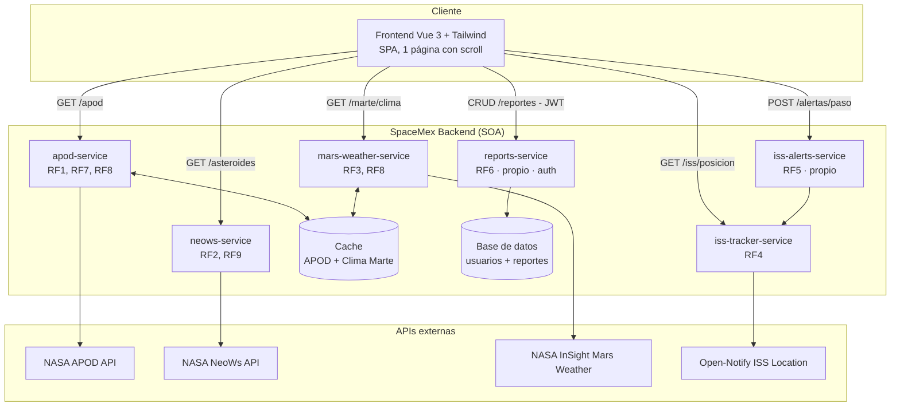

# Arquitectura del Sistema — SpaceMex

**NASA Space Dashboard · Arquitectura Orientada a Servicios (SOA) · 2026**

## 1. Visión general

SpaceMex sigue una **arquitectura orientada a servicios (SOA)**: el frontend (Vue 3 + Tailwind) es un cliente único que consume múltiples servicios independientes vía HTTP/REST. Cada servicio encapsula una funcionalidad de negocio, puede fallar o escalar sin afectar a los demás (RNF5) y puede actualizarse de forma independiente (RNF8).

Hay dos tipos de servicios:

- **Servicios wrapper** (`apod-service`, `neows-service`, `mars-weather-service`, `iss-tracker-service`): exponen un API propia simplificada que internamente consume una API externa de la NASA / Open Notify. Esto desacopla al frontend de las APIs externas (cambios de contrato, caída del proveedor, rate limits, API keys).
- **Servicios propios** (`iss-alerts-service`, `reports-service`): lógica de negocio exclusiva de SpaceMex, con persistencia propia.

## 2. Diagrama de componentes

## 3. Servicios y responsabilidades

| Servicio | Tipo | Responsabilidad | API externa consumida | Endpoint propio (propuesto) |
|---|---|---|---|---|
| `apod-service` | Wrapper + caché | Foto del día y búsqueda histórica | NASA APOD `/planetary/apod` | `GET /apod`, `GET /apod?date=YYYY-MM-DD` |
| `neows-service` | Wrapper | Asteroides cercanos con filtros | NASA NeoWs `/neo/rest/v1/feed` | `GET /asteroides?start_date=&end_date=&size=&hazardous=` |
| `mars-weather-service` | Wrapper + caché | Clima en Marte | NASA InSight `/insight_weather/` | `GET /marte/clima` |
| `iss-tracker-service` | Wrapper | Posición actual de la ISS | Open-Notify `/iss-now.json` | `GET /iss/posicion` |
| `iss-alerts-service` | Propio | Cálculo de pasos de la ISS sobre una ciudad | Consume `iss-tracker-service` internamente | `POST /alertas/paso` |
| `reports-service` | Propio | CRUD de observaciones astronómicas, autenticación | — | `GET/POST /reportes`, `PUT/DELETE /reportes/{id}` |

## 4. Comunicación entre componentes

- **Frontend → servicios:** HTTP/REST, JSON. El frontend nunca llama directamente a APIs externas (NASA, Open Notify): siempre pasa por el wrapper correspondiente. Esto centraliza el manejo de `api_key` de NASA y evita exponerla en el cliente.
- **Servicio → servicio:** `iss-alerts-service` consulta a `iss-tracker-service` (o a Open-Notify directamente, a definir) para calcular los próximos pasos sobre una ciudad.
- **Manejo de fallos (RNF5):** si una API externa falla o tarda, el wrapper correspondiente debe responder con un error controlado (timeout configurable, RNF1: máx. 3s) sin afectar a los demás servicios ni colgar el frontend. El frontend debe mostrar un estado de error/carga por sección de forma independiente.

## 5. Estrategia de caché (RF8)

`apod-service` y `mars-weather-service` implementan un **Cache Handler** para reducir llamadas a las APIs externas de NASA:

- **APOD:** la foto del día cambia una vez por día → caché con expiración diaria (ej. hasta medianoche UTC). Las consultas históricas (`?date=`) se cachean indefinidamente (no cambian).
- **Clima en Marte:** los datos de InSight se actualizan con poca frecuencia (por "sol marciano") → caché con expiración configurable (ej. cada pocas horas).
- Implementación sugerida: caché en memoria (ej. `node-cache`) para el MVP; posibilidad de migrar a Redis si se requiere compartir caché entre instancias (RNF6).

## 6. Autenticación y seguridad (RNF3)

- `reports-service` es el único servicio que requiere autenticación (sección "Mis Reportes" del dashboard).
- Propuesta: autenticación basada en **JWT** — el usuario inicia sesión, recibe un token, y lo envía en el header `Authorization: Bearer <token>` en cada request a `/reportes/*`.
- Los demás servicios (APOD, NeoWs, Marte, ISS) son de solo lectura y públicos, sin autenticación.
- Las `api_key` de NASA se manejan como variables de entorno (`.env`, no se versionan — ver `.gitignore`) y nunca se exponen al frontend.

## 7. Escalabilidad y disponibilidad (RNF2, RNF6)

- Cada servicio puede desplegarse y escalarse de forma independiente (contenedores Docker, por ejemplo).
- `reports-service` es el único con estado persistente (base de datos); el resto son mayormente *stateless* (salvo la caché), lo que facilita escalado horizontal.
- RNF2 (99.5% disponibilidad) se mide sobre los servicios propios de SpaceMex; caídas de APIs externas (NASA, Open Notify) quedan fuera del cálculo, pero deben manejarse con gracia (errores controlados, no caídas en cascada).

## 8. Internacionalización (RNF9)

La interfaz debe soportar español e inglés. Se recomienda manejar las traducciones en el frontend (ej. `vue-i18n`), con los servicios devolviendo datos "crudos" (números, fechas, claves) y dejando el formato/idioma a la capa de presentación.

## 9. Stack tecnológico por capa

| Capa | Tecnología |
|---|---|
| Frontend | Vue.js 3 + Tailwind CSS (SPA, 1 página, scroll, navbar sticky con anclas) |
| Backend (cada servicio) | Node.js + Express |
| Comunicación | HTTP/REST + JSON |
| Caché | En memoria (node-cache) — evaluar Redis si se necesita compartir entre instancias |
| Base de datos (reports-service) | A definir en `modelo_datos.md` |
| Autenticación | JWT (propuesta) |

## 10. Próximos pasos

- Definir modelo de datos de `reports-service` y (si aplica) usuarios → `docs/modelo_datos.md`
- Decidir mecanismo concreto de autenticación (JWT propio vs. proveedor externo)
- Definir estrategia de despliegue (Docker Compose para desarrollo local, dado que son 6 servicios + frontend)
