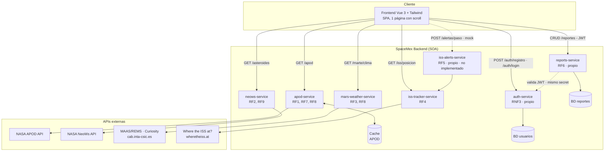

# Arquitectura del Sistema — SpaceMex

**NASA Space Dashboard · Arquitectura Orientada a Servicios (SOA) · 2026**

## 1. Visión general

SpaceMex sigue una **arquitectura orientada a servicios (SOA)**: el frontend (Vue 3 + Tailwind) es un cliente único que consume múltiples servicios independientes vía HTTP/REST. Cada servicio encapsula una funcionalidad de negocio, puede fallar o escalar sin afectar a los demás (RNF5) y puede actualizarse de forma independiente (RNF8).

Hay dos tipos de servicios:

- **Servicios wrapper** (`apod-service`, `neows-service`, `mars-weather-service`, `iss-tracker-service`): exponen un API propia simplificada que internamente consume una API externa (NASA APOD/NeoWs, MAAS/REMS para Marte, `wheretheiss.at` para la ISS). Esto desacopla al frontend de las APIs externas (cambios de contrato, caída del proveedor, rate limits, API keys).
- **Servicios propios** (`auth-service`, `iss-alerts-service`, `reports-service`): lógica de negocio exclusiva de SpaceMex, con persistencia propia. `auth-service` gestiona identidad y emite JWT; `reports-service` valida ese JWT.

> **Cambios respecto al plan original (09/07/2026):** el clima de Marte dejó de usar NASA InSight (misión finalizada) por la API MAAS/REMS del rover Curiosity; la posición de la ISS dejó de usar Open-Notify (HTTP inestable) por `wheretheiss.at` (HTTPS); y la autenticación se extrajo de `reports-service` a un `auth-service` independiente. Con esto el sistema pasa de 6 a **7 servicios**.

## 2. Diagrama de componentes

## 3. Servicios y responsabilidades

| Servicio | Puerto | Tipo | Responsabilidad | API externa consumida | Endpoint propio |
|---|---|---|---|---|---|
| `apod-service` | 3001 | Wrapper + caché | Foto del día y búsqueda histórica | NASA APOD `/planetary/apod` | `GET /apod`, `GET /apod?date=YYYY-MM-DD` |
| `mars-weather-service` | 3002 | Wrapper | Clima en Marte | MAAS/REMS (Curiosity) `cab.inta-csic.es/.../api.php` | `GET /marte/clima` |
| `neows-service` | 3003 | Wrapper | Asteroides cercanos con filtros | NASA NeoWs `/neo/rest/v1/feed` | `GET /asteroides?start_date=&end_date=` |
| `iss-tracker-service` | 3004 | Wrapper | Posición actual de la ISS | Where the ISS at? `/v1/satellites/25544` | `GET /iss/posicion` |
| `auth-service` | 3005 | Propio | Registro, login y emisión de JWT | — | `POST /auth/registro`, `POST /auth/login` |
| `reports-service` | 3006 | Propio | CRUD de observaciones astronómicas (valida JWT) | — | `GET/POST /reportes`, `PUT/DELETE /reportes/{id}` |
| `iss-alerts-service` | — | Propio | Cálculo de pasos de la ISS sobre una ciudad | Consume `iss-tracker-service` internamente | `POST /alertas/paso` *(no implementado)* |

> El filtrado de asteroides por tamaño y peligrosidad (RF9) se resuelve en el frontend sobre la respuesta de `neows-service`, que ya incluye el diámetro estimado y el indicador de peligrosidad de cada objeto.

## 4. Comunicación entre componentes

- **Frontend → servicios:** HTTP/REST, JSON. El frontend nunca llama directamente a APIs externas (NASA, Open Notify): siempre pasa por el wrapper correspondiente. Esto centraliza el manejo de `api_key` de NASA y evita exponerla en el cliente.
- **Servicio → servicio:** `iss-alerts-service` (cuando se implemente) consultará a `iss-tracker-service` para calcular los próximos pasos sobre una ciudad. `reports-service` no llama a `auth-service` por red: **valida el JWT localmente** compartiendo el mismo `JWT_SECRET` que `auth-service` usó para firmarlo (verificación sin estado, sin acoplamiento en tiempo de ejecución).
- **Manejo de fallos (RNF5):** si una API externa falla o tarda, el wrapper correspondiente debe responder con un error controlado (timeout configurable, RNF1: máx. 3s) sin afectar a los demás servicios ni colgar el frontend. El frontend debe mostrar un estado de error/carga por sección de forma independiente.

## 5. Estrategia de caché (RF8)

El **Cache Handler** reduce llamadas a las APIs externas:

- **APOD (implementado):** la foto del día cambia una vez por día → caché en memoria (`Map`) con expiración al cambio de día UTC. Las consultas históricas (`?date=`) se cachean indefinidamente (no cambian). Implementado dentro de `apod-service/index.js`.
- **Clima en Marte (pendiente):** los datos de MAAS/REMS se actualizan con poca frecuencia (por "sol marciano") → se planea caché con expiración configurable (ej. cada pocas horas). Aún **no implementado** en `mars-weather-service` (hoy solo cae a un objeto de ejemplo si la fuente falla).
- Posibilidad de migrar a `node-cache`/Redis si se requiere compartir caché entre instancias (RNF6).

## 6. Autenticación y seguridad (RNF3)

- La autenticación (**JWT**) la centraliza `auth-service`: el usuario se registra o inicia sesión (`/auth/registro`, `/auth/login`), recibe un token y lo envía en el header `Authorization: Bearer <token>`.
- `reports-service` es el consumidor de esos tokens: valida el JWT en cada request a `/reportes/*` usando el mismo `JWT_SECRET`. Es el único servicio de datos que requiere autenticación (sección "Mis Reportes" del dashboard).
- Los servicios wrapper (APOD, NeoWs, Marte, ISS) son de solo lectura y públicos, sin autenticación.
- Los secretos (`JWT_SECRET`, `DATABASE_URL`, `api_key` de NASA) se manejan como variables de entorno (`.env`, no se versionan — ver `.gitignore`) y nunca se exponen al frontend. `auth-service` y `reports-service` deben compartir el mismo `JWT_SECRET`.

## 7. Escalabilidad y disponibilidad (RNF2, RNF6)

- Cada servicio puede desplegarse y escalarse de forma independiente (contenedores Docker, por ejemplo).
- `auth-service` y `reports-service` son los servicios con estado persistente (cada uno con su **propia** base de datos PostgreSQL, RNF5); el resto son mayormente *stateless* (salvo la caché de APOD), lo que facilita escalado horizontal.
- RNF2 (99.5% disponibilidad) se mide sobre los servicios propios de SpaceMex; caídas de APIs externas (NASA, Open Notify) quedan fuera del cálculo, pero deben manejarse con gracia (errores controlados, no caídas en cascada).

## 8. Internacionalización (RNF9)

La interfaz debe soportar español e inglés. Se recomienda manejar las traducciones en el frontend (ej. `vue-i18n`), con los servicios devolviendo datos "crudos" (números, fechas, claves) y dejando el formato/idioma a la capa de presentación.

## 9. Stack tecnológico por capa

| Capa | Tecnología |
|---|---|
| Frontend | Vue.js 3 + Tailwind CSS (SPA, 1 página, scroll, navbar sticky con anclas) |
| Backend (cada servicio) | Node.js + Express |
| Comunicación | HTTP/REST + JSON |
| Caché | En memoria (`Map` en `apod-service`) — evaluar `node-cache`/Redis si se necesita compartir entre instancias |
| Base de datos (`auth-service`, `reports-service`) | PostgreSQL (una BD por servicio) — ver `modelo_datos.md` |
| Autenticación | JWT emitido por `auth-service` (`jsonwebtoken` + `bcryptjs`) |

## 10. Próximos pasos

- Implementar `iss-alerts-service` (RF5): algoritmo de predicción de pasos y endpoint `POST /alertas/paso`; hoy el frontend usa datos mock.
- Implementar la caché de `mars-weather-service` (RF8), pendiente.
- Definir estrategia de despliegue (Docker Compose para desarrollo local, dado que son 7 servicios + frontend).
