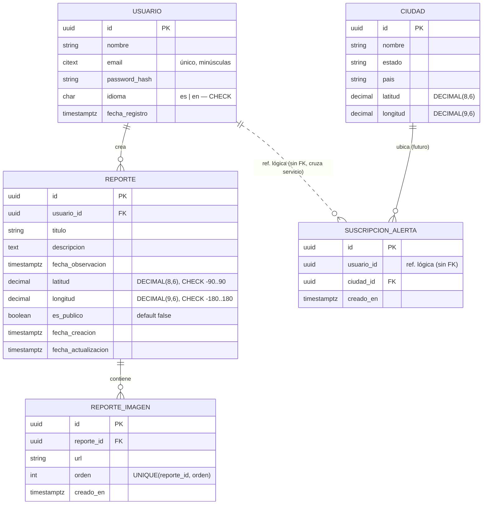

# Modelo de Datos — SpaceMex

**NASA Space Dashboard · Servicios propios · 2026**

## 1. Alcance y propiedad de datos (SOA)

De los 6 servicios SOA, solo los **servicios propios** requieren persistencia:

- `reports-service` — es dueño de `usuario`, `reporte`, `reporte_imagen` (RF6, RNF3)
- `iss-alerts-service` — es dueño de `ciudad`, `suscripcion_alerta`; persistencia **opcional** (el MVP calcula pasos on-demand, RF5)

Los servicios wrapper (`apod-service`, `neows-service`, `mars-weather-service`, `iss-tracker-service`) no tienen base de datos; `apod-service` y `mars-weather-service` usan una **caché en memoria** (RF8), sección 6.

> **Regla SOA (RNF5):** cada servicio es dueño de su propia base de datos. Ninguna FK física cruza el límite de un servicio. `suscripcion_alerta.usuario_id` es una **referencia lógica** al usuario de `reports-service` (sin `FOREIGN KEY` constraint) — ver sección 5.
>
> **Nota sobre autenticación:** en este MVP `usuario` vive en `reports-service`. Si más adelante se separa un `auth-service` dueño de los usuarios, entonces `reporte.usuario_id` también pasa a ser referencia lógica bajo la misma regla.

**Identificadores:** todas las PK son **UUID** (v4). En SOA evita acoplar servicios a secuencias compartidas y hace seguras las referencias lógicas entre servicios (no colisionan ni filtran conteos).

## 2. Diagrama entidad-relación

## 3. Entidades — `reports-service`

### 3.1 Usuario

Necesario para autenticación (RNF3) y para asociar reportes a su autor.

| Campo | Tipo | Restricciones | Descripción |
|---|---|---|---|
| `id` | UUID | PK | Identificador único |
| `nombre` | varchar | requerido | Nombre del usuario |
| `email` | citext | requerido, único | Login. `citext` (o normalizar a minúsculas al guardar) para que el `UNIQUE` no distinga mayúsculas |
| `password_hash` | varchar | requerido | Contraseña con hash (bcrypt/argon2) — **nunca en texto plano** |
| `idioma` | char(2) | `CHECK (idioma IN ('es','en'))`, default `es` | Soporta RNF9 |
| `fecha_registro` | timestamptz | default `now()` | Fecha de creación de la cuenta |

> Nunca se almacena la contraseña en texto plano ni se devuelve `password_hash` en respuestas de la API.

### 3.2 Reporte (Observación astronómica)

Corresponde a RF6 y al Servicio 6 del documento de requerimientos.

| Campo | Tipo | Restricciones | Descripción |
|---|---|---|---|
| `id` | UUID | PK | Identificador único del reporte |
| `usuario_id` | UUID | FK → Usuario, requerido | Autor del reporte |
| `titulo` | varchar | requerido | Título de la observación |
| `descripcion` | text | requerido | Descripción de lo observado |
| `fecha_observacion` | timestamptz | requerido | **Fecha y hora** de la observación (un tránsito de la ISS o un meteoro se define al minuto → se necesita hora + zona) |
| `latitud` | DECIMAL(8,6) | requerido, `CHECK (latitud BETWEEN -90 AND 90)` | Coordenada del punto de observación (DECIMAL evita el error de precisión de `float`) |
| `longitud` | DECIMAL(9,6) | requerido, `CHECK (longitud BETWEEN -180 AND 180)` | Coordenada del punto de observación |
| `es_publico` | boolean | requerido, default `false` | Si aparece en el listado comunitario |
| `fecha_creacion` | timestamptz | default `now()` | Timestamp de creación del registro |
| `fecha_actualizacion` | timestamptz | on update | Timestamp de la última edición |

**Reglas de negocio:**

- Un usuario solo puede editar (`PUT`) o eliminar (`DELETE`) sus propios reportes (`reporte.usuario_id == usuario_autenticado.id`).
- `GET /reportes` devuelve los reportes del usuario autenticado; un endpoint público adicional puede listar solo los de `es_publico = true` para la vista comunitaria.

### 3.3 Reporte-Imagen

Separada de `reporte` para permitir 0..N imágenes por observación (1NF).

| Campo | Tipo | Restricciones | Descripción |
|---|---|---|---|
| `id` | UUID | PK | Identificador único |
| `reporte_id` | UUID | FK → Reporte, requerido, `ON DELETE CASCADE` | Reporte al que pertenece |
| `url` | varchar | requerido | URL de la imagen (almacenamiento externo, ej. S3/Cloudinary) |
| `orden` | int | default 0, `UNIQUE(reporte_id, orden)` | Orden determinista en la galería |
| `creado_en` | timestamptz | default `now()` | Fecha de subida |

> Si el MVP se limita a **una imagen** por reporte, se mantiene esta tabla con `UNIQUE(reporte_id)`; así el modelo no cambia si luego se permiten varias.

## 4. Índices recomendados (`reports-service`)

| Tabla | Índice | Para qué |
|---|---|---|
| `reporte` | `(usuario_id)` | Listar los reportes de un usuario (`GET /reportes`) |
| `reporte` | `(es_publico, fecha_creacion)` | Listado comunitario: `WHERE es_publico = true ORDER BY fecha_creacion DESC` |
| `reporte_imagen` | `(reporte_id)` | Traer las imágenes de un reporte |
| `usuario` | `UNIQUE(email)` | Login y unicidad |

## 5. Entidad opcional — `iss-alerts-service`

El RF5 pide notificar cuándo la ISS pasará sobre la ciudad del usuario. En el MVP, `POST /alertas/paso` calcula los próximos pasos **on-demand** recibiendo `latitud`/`longitud` en cada request (sin persistir).

Si se ofrecen **suscripciones persistentes**, este servicio (dueño de su propia BD) define:

### 5.1 Ciudad

Extraída para eliminar la dependencia transitiva `nombre → coordenadas` (3NF).

| Campo | Tipo | Restricciones | Descripción |
|---|---|---|---|
| `id` | UUID | PK | Identificador |
| `nombre` | varchar | requerido | Nombre de la ciudad |
| `estado` | varchar | requerido | Estado/provincia (desambigua homónimas: León Gto vs León Esp) |
| `pais` | varchar | requerido | País (ISO 3166 recomendado) |
| `latitud` | DECIMAL(8,6) | requerido, `CHECK -90..90` | Coordenada de la ciudad |
| `longitud` | DECIMAL(9,6) | requerido, `CHECK -180..180` | Coordenada de la ciudad |

**Identidad:** `UNIQUE(nombre, estado, pais)`; el par `(latitud, longitud)` es la identidad geográfica real y también puede indexarse. `nombre` solo **no** es único (hay ciudades homónimas).

### 5.2 Suscripción de Alerta

| Campo | Tipo | Restricciones | Descripción |
|---|---|---|---|
| `id` | UUID | PK | Identificador único |
| `usuario_id` | UUID | **referencia lógica** (sin FK, cruza a `reports-service`), requerido | Dueño de la suscripción |
| `ciudad_id` | UUID | FK → Ciudad, requerido | Ciudad a vigilar |
| `creado_en` | timestamptz | default `now()` | Fecha de suscripción |

- `UNIQUE(usuario_id, ciudad_id)` — evita suscripciones duplicadas del mismo usuario a la misma ciudad.
- La validez de `usuario_id` la garantiza la capa de aplicación (token de auth), no un constraint de BD, porque el usuario vive en otro servicio (RNF5).

> Marcado como **fuera del alcance del MVP**. Se documenta para una iteración futura.

## 6. Estructura de caché (RF8) — `apod-service` y `mars-weather-service`

Caché **clave-valor en memoria** (ej. `node-cache`), no relacional:

### Caché APOD

| Clave | Valor | Expiración |
|---|---|---|
| `apod:YYYY-MM-DD` | `{ titulo, descripcion, url, media_type, fecha, autor }` | Día actual: hasta medianoche UTC. Fechas históricas: sin expiración (no cambian). |

### Caché Clima Marte

| Clave | Valor | Expiración |
|---|---|---|
| `mars_weather:latest` | `{ sol, temperatura_min, temperatura_max, viento_velocidad, viento_direccion, presion, fecha_actualizacion }` | Configurable (ej. 3–6 h), según la frecuencia de la fuente. |

## 7. Consideraciones generales

- **Motor de base de datos:** **PostgreSQL** recomendado — soporta `UUID`, `citext`, `CHECK`, `DECIMAL` y `timestamptz` de forma nativa, y encaja con las relaciones 1:N (Usuario↔Reporte, Reporte↔Imagen). Cada servicio propio tiene su **propia base** (RNF5).
- **Migraciones:** herramienta de migraciones (Prisma, Sequelize, Knex) para versionar el esquema junto al código de cada servicio.
- **Privacidad:** las coordenadas de un reporte con `es_publico = false` no deben exponerse en endpoints públicos/comunitarios.
- **Integridad referencial:** `reporte_imagen` con `ON DELETE CASCADE` hacia `reporte`; `reporte` hacia `usuario` según la política de baja de cuentas. Las referencias **lógicas** entre servicios se validan en la capa de aplicación, no en la BD.
