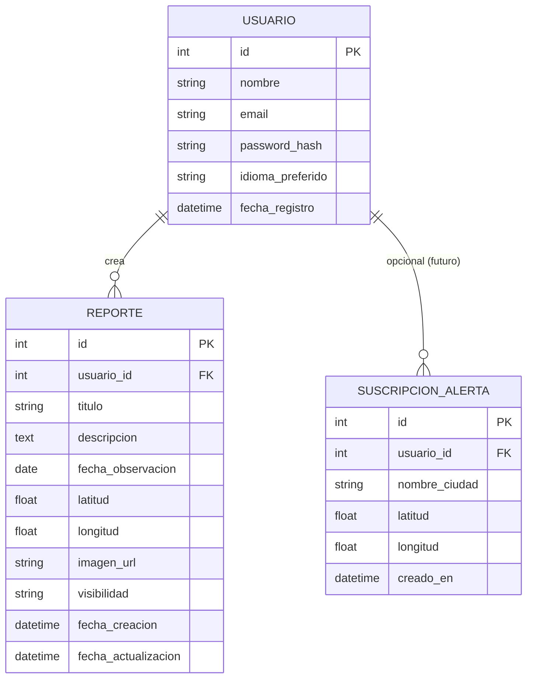

# Modelo de Datos — SpaceMex

**NASA Space Dashboard · Servicios propios · 2026**

## 1. Alcance

De los 6 servicios SOA, solo los **servicios propios** requieren persistencia propia:

- `reports-service` — usuarios y reportes/observaciones astronómicas (RF6, RNF3)
- `iss-alerts-service` — sin persistencia obligatoria en el MVP (cálculo on-demand, RF5); se documenta un modelo opcional para suscripciones futuras

Los servicios wrapper (`apod-service`, `neows-service`, `mars-weather-service`, `iss-tracker-service`) no tienen base de datos propia; `apod-service` y `mars-weather-service` usan una **caché en memoria** (RF8), descrita en la sección 5.

## 2. Diagrama entidad-relación

## 3. Entidades — `reports-service`

### 3.1 Usuario

Necesario para autenticación (RNF3) y para asociar reportes a su autor.

| Campo | Tipo | Restricciones | Descripción |
|---|---|---|---|
| `id` | integer / UUID | PK, autogenerado | Identificador único |
| `nombre` | string | requerido | Nombre del usuario |
| `email` | string | requerido, único | Usado para login |
| `password_hash` | string | requerido | Contraseña almacenada con hash (ej. bcrypt) — **nunca en texto plano** |
| `idioma_preferido` | enum(`es`, `en`) | opcional, default `es` | Soporta RNF9 |
| `fecha_registro` | datetime | autogenerado | Fecha de creación de la cuenta |

> No se almacena la contraseña en texto plano ni se devuelve `password_hash` en ninguna respuesta de la API.

### 3.2 Reporte (Observación astronómica)

Corresponde a RF6 y al detalle del Servicio 6 (API de Reportes Espaciales) del documento de requerimientos.

| Campo | Tipo | Restricciones | Descripción |
|---|---|---|---|
| `id` | integer / UUID | PK, autogenerado | Identificador único del reporte |
| `usuario_id` | integer / UUID | FK → Usuario, requerido | Autor del reporte |
| `titulo` | string | requerido | Título de la observación |
| `descripcion` | text | requerido | Descripción de lo observado |
| `fecha_observacion` | date | requerido | Fecha en que se realizó la observación |
| `latitud` | float | requerido | Coordenada de la observación |
| `longitud` | float | requerido | Coordenada de la observación |
| `imagen_url` | string | opcional | URL de imagen adjunta (almacenamiento externo, ej. S3/Cloudinary) |
| `visibilidad` | enum(`publica`, `privada`) | requerido, default `privada` | Define si aparece en el listado comunitario |
| `fecha_creacion` | datetime | autogenerado | Timestamp de creación del registro |
| `fecha_actualizacion` | datetime | autogenerado, on update | Timestamp de la última edición |

**Reglas de negocio:**

- Un usuario solo puede editar (`PUT`) o eliminar (`DELETE`) sus propios reportes (`reportes.usuario_id == usuario_autenticado.id`).
- `GET /reportes` devuelve los reportes del usuario autenticado; un endpoint público adicional (a definir) podría listar solo los `publica` de todos los usuarios para la vista comunitaria.

## 4. Entidad opcional — `iss-alerts-service`

El RF5 pide notificar al usuario cuando la ISS pasará sobre su ciudad. Para el MVP, `POST /alertas/paso` puede calcular los próximos pasos **on-demand** (sin guardar nada), recibiendo `latitud`/`longitud` en cada request.

Si se quiere ofrecer **suscripciones persistentes** (avisar automáticamente sin que el usuario vuelva a consultar), se propone:

### Suscripción de Alerta

| Campo | Tipo | Restricciones | Descripción |
|---|---|---|---|
| `id` | integer / UUID | PK, autogenerado | Identificador único |
| `usuario_id` | integer / UUID | FK → Usuario, opcional | Si se requiere login para suscribirse |
| `nombre_ciudad` | string | opcional | Nombre legible de la ciudad |
| `latitud` | float | requerido | Coordenada de la ciudad |
| `longitud` | float | requerido | Coordenada de la ciudad |
| `creado_en` | datetime | autogenerado | Fecha de suscripción |

> Marcado como **fuera del alcance del MVP** (sección 2.2 de requerimientos no lo excluye explícitamente, pero no es necesario para cumplir RF5 de forma básica). Se deja documentado para una iteración futura.

## 5. Estructura de caché (RF8) — `apod-service` y `mars-weather-service`

No es una base de datos relacional, sino una **caché clave-valor en memoria** (ej. `node-cache`), con la siguiente forma conceptual:

### Caché APOD

| Clave | Valor | Expiración |
|---|---|---|
| `apod:YYYY-MM-DD` | `{ titulo, descripcion, url, media_type, fecha, autor }` | Foto del día actual: hasta medianoche UTC. Fechas históricas: sin expiración (no cambian). |

### Caché Clima Marte

| Clave | Valor | Expiración |
|---|---|---|
| `mars_weather:latest` | `{ sol, temperatura_min, temperatura_max, viento_velocidad, viento_direccion, presion, fecha_actualizacion }` | Configurable (ej. 3–6 horas), según frecuencia de actualización de InSight |

## 6. Consideraciones generales

- **Motor de base de datos:** a elegir entre relacional (PostgreSQL/MySQL — recomendado por la relación Usuario↔Reporte 1:N) o NoSQL (MongoDB). El modelo aquí descrito asume relacional, pero es trasladable a documentos.
- **Migraciones:** usar una herramienta de migraciones (ej. Prisma, Sequelize, Knex) para versionar el esquema junto con el código de `reports-service`.
- **Privacidad:** los campos `latitud`/`longitud` de un reporte `privada` no deben exponerse en endpoints públicos/comunitarios.
